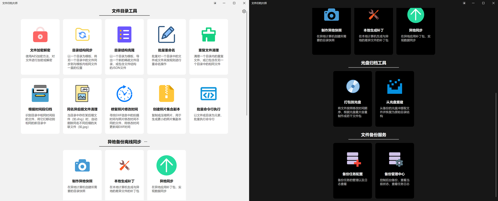
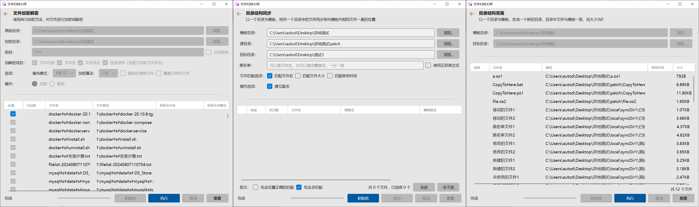
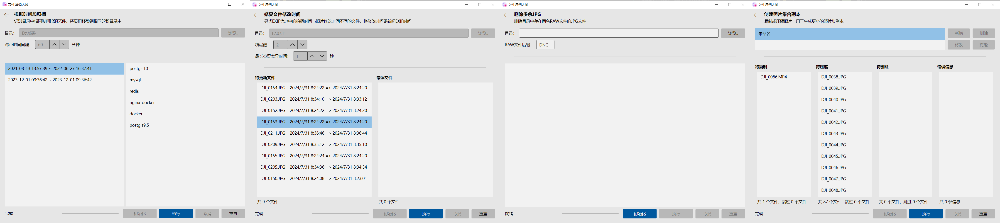
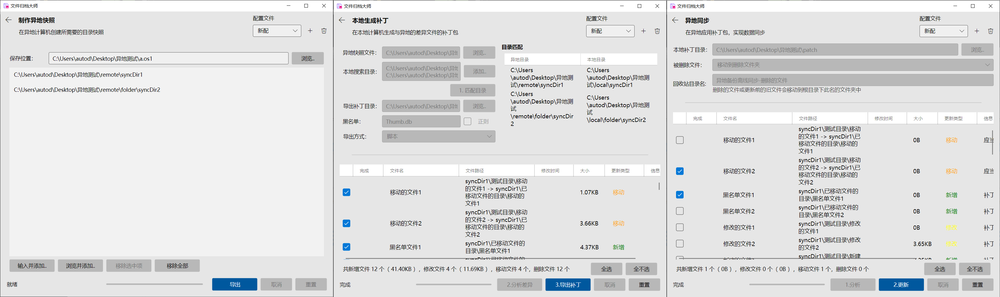
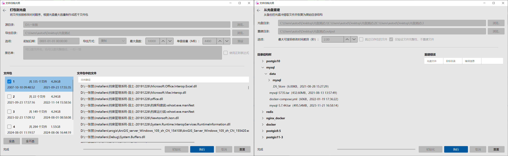
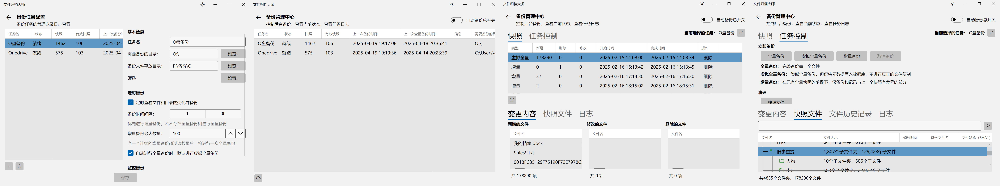

# 简介

这是一套协助用户对文件进行处理、管理、备份、同步的工具集。

在开始这个项目之前的许多年，我已经陆续写了很多的用于备份、同步、管理文件或照片的软件，包括：

- [文件自动备份系统](https://github.com/autodotua/FileBackuper_New)
- 文件批量操作
- [异地备份离线同步](https://github.com/autodotua/OffsiteBackupOfflineSync)
- [照片瘦身工具](https://github.com/autodotua/PhotoSlimming)
- [照片归档工具](https://github.com/autodotua/PhotoArchivingTools)
- [光盘归档工具](https://github.com/autodotua/DiscArchivingTool)
- 控制台小程序集
- 文件归位器
- 文件夹加密

这些工具功能各异，界面各不相同，技术水平差异很大，操作方式也不尽相同。因此，我希望通过本项目，把这些工具进行整合，使用跨平台的[Avalonia](https://github.com/AvaloniaUI/Avalonia)技术承载GUI。

# 截图

## 主界面

## 文件目录工具

## 异地备份离线同步

## 光盘归档工具

## 文件备份服务

# 工具

## 文件目录工具（`FileTools`）

一套用来解决文件、目录（特别是图像文件）在预处理、整理、存档、浏览等环节存在问题的自动化工具

| 工具名       | 用途                                                         | 期望解决的问题                                               | 类名前缀             | 原项目                                                       | 开发进度 |
|-----------| ------------------------------------------------------------ | ------------------------------------------------------------ | -------------------- | ------------------------------------------------------------ | -------- |
| 根据时间段归档   | 识别目录中相同时间段的文件，将它们移动到相同的新目录中       | 例如对于航拍照片，多次起飞的照片和视频会混在一起。通过该工具，可以通过拍摄时间来自动将不同航次的照片和视频进行归类。 | `TimeClassify`       | [照片归档工具](https://github.com/autodotua/PhotoArchivingTools) | 已完成   |
| 同名异后缀文件清理 | 当目录中存在某后缀文件（如.dng）时，自动删除同名不同后缀的关联文件（如.jpg）                           | 当拍摄了RAW+JPG格式的照片时，若决定处理RAW文件，那么JPG格式是多余的，需要删除。 | `TwinFileCleaner`  | [照片归档工具](https://github.com/autodotua/PhotoArchivingTools) | 已完成   |
| 修复照片修改时间  | 寻找EXIF信息中的拍摄时间与照片修改时间不同的文件，将修改时间更新闻EXIF时间 | 对照片进行处理后，文件修改时间会更新，不利于部分软件的照片排序，需要从EXIF中读取实际拍摄时间，对文件修改时间进行更新。 | `RepairModifiedTime` | [照片归档工具](https://github.com/autodotua/PhotoArchivingTools) 控制台小程序集 | 已完成   |
| 创建照片集合副本  | 复制或压缩照片，用于生成更小的照片集副本                     | 需要将硬盘中整理后的部分照片复制到手机中以便随时查看，但可能存在文件过大放不进手机、只需要部分目录中的文件、只需要部分类型文件等需求。 | `PhotoSlimming`      | [照片归档工具](https://github.com/autodotua/PhotoArchivingTools) [照片瘦身工具](https://github.com/autodotua/PhotoSlimming) | 已完成   |
| 文件加密解密 | 使用AES加密方法，对文件进行加密或解密 | 需要对一个文件夹内的文件和子文件进行加密，并需要保留目录结构，需要加密文件名、文件夹名或目录结构。 | `Encryptor` | [照片归档工具](https://github.com/autodotua/PhotoArchivingTools) 文件夹加密 | 已完成 |
| 目录结构同步 | 以一个目录为模板，将另一个目录中的文件同步到与模板内相同文件一直的位置 | 有两份初始状态一样的目录，其中一份中的某些文件进行了移动等操作，希望能够让另一份也同步应用更改，避免不必要的复制操作。 | `DirStructureSync` | [异地备份离线同步](https://github.com/autodotua/OffsiteBackupOfflineSync) 控制台小程序集 | 已完成 |
| 目录结构克隆 | 以一个目录为模板，生成一个新的目录，目录中文件与模板一致，但大小为0 | 需要保存一个目录的结构，但是不需要了解文件的内容，只是想用尽可能小的容量存储文件树状结构。 | `DirStructureClone` | [异地备份离线同步](https://github.com/autodotua/OffsiteBackupOfflineSync) 文件归位器 | 已完成 |
| 批量重命名 | 批量对一个目录中的文件或文件夹按规则进行重命名操作 | 需要对一个目录中的文件按一定规则进行重命名。 | `Rename` | 文件批量操作 | 已完成 |
| 重复文件清理 | 清理一个目录内的重复文件，或已包含在另一个目录中的相同文件 | 一些相同的文件散落在各个地方，为了节省空间，需要删除一部分 | `DuplicateFileCleanup` | 控制台小程序集 | 已完成 |
| 批量命令行执行 | 以文件或目录为元素，批量执行命令行 | 有一个能够传入参数的可执行文件，需要将某个目录下的所有子目录或文件作为参数，传入可执行文件并运行，每个子目录或文件作为参数运行一次。例如需要对指定目录下筛选后的文件分别压缩。 | `BatchCommandLine` |  | 已完成 |
| 文件系统监控 | 监控程序对文件系统的读写 |  |  |  | 未开始 |

## 异地备份离线同步（`OfflineSync`）

在无法通过网络或实地全量同步的情况下，使用增量同步的方式，利用小容量设备完成异地和本地磁盘的数据同步

| 工具名       | 用途                                     | 类名前缀 | 原项目                                                       | 开发进度 |
| ------------ | ---------------------------------------- | -------- | ------------------------------------------------------------ | -------- |
| 制作异地快照 | 在异地计算机创建所需要的目录快照         | `Step1`  | [异地备份离线同步](https://github.com/autodotua/PhotoArchivingTools) | 已完成   |
| 本地生成补丁 | 在本地计算机生成与异地的差异文件的补丁包 | `Step2`  | [异地备份离线同步](https://github.com/autodotua/OffsiteBackupOfflineSync) | 已完成   |
| 异地同步     | 在异地应用补丁包，实现数据同步           | `Step3`  | [异地备份离线同步](https://github.com/autodotua/OffsiteBackupOfflineSync) | 已完成   |

## 光盘归档工具（`DiscArchive`）

将一个持续更新目录中的文件，按从旧到新的时间顺序，分装到多个光盘中，实现备份功能。

| 工具名     | 用途                                     | 类名前缀  | 原项目                                                       | 开发进度 |
| ---------- | ---------------------------------------- | --------- | ------------------------------------------------------------ | -------- |
| 打包到光盘 | 将待备份文件，根据光盘的大小，分成多个包 | `Packing` | [光盘归档工具](https://github.com/autodotua/DiscArchivingTool) | 已完成   |
| 从光盘重建 | 从多张光盘重建磁盘文件                   | `Rebuild` | [光盘归档工具](https://github.com/autodotua/DiscArchivingTool) | 已完成   |

## 文件备份服务（`FileBackupper`）

将目录中的文件定时或实时备份到另一个位置，支持全量备份或增量备份

| 工具名       | 用途                                                         | 类名前缀 | 原项目                                                       | 开发进度     |
| ------------ | ------------------------------------------------------------ | -------- | ------------------------------------------------------------ | ------------ |
| 备份任务配置 | 对备份任务进行新增、删除、修改配置                           | /        | [文件自动备份系统](https://github.com/autodotua/FileBackuper_New) | 主体功能完成 |
| 备份管理中心 | 查看备份任务的信息、进行手动备份，查看快照、快照文件、日志等 | /        | [文件自动备份系统](https://github.com/autodotua/FileBackuper_New) | 主体功能完成 |

下一步计划：增加FileWatcher备份、定时全量备份、删除日志、删除快照、清理物理备份文件

# 基本使用说明

## 筛选

文件目录筛选界面允许您通过设置白名单和黑名单规则来筛选文件和文件夹。您可以使用两种匹配模式：
1. 通配符模式（默认）：使用简单的通配符语法
2. 正则表达式模式：使用更强大的正则表达式语法

### 规则

#### 白名单规则（包含）

- 包含的文件：匹配文件名
- 包含的文件夹：匹配文件夹名
- 包含的路径：匹配完整路径

#### 黑名单规则（排除）

- 排除的文件：排除特定文件名
- 排除的文件夹：排除特定文件夹名
- 排除的路径：排除特定完整路径

#### 匹配逻辑

1. 文件必须满足所有白名单条件
2. 文件必须不满足任何黑名单条件
3. 匹配顺序：
   - 先检查文件名
   - 然后检查完整路径
   - 最后检查路径中的各个文件夹名

### 匹配模式

| 匹配模式       | 描述                                                         | 适用场景                           |
| -------------- | ------------------------------------------------------------ | ---------------------------------- |
| 通配符模式     | 使用简单的`*`和`?`通配符 `*`匹配0或多个任意字符 `?`匹配1个任意字符 | 简单匹配需求，如筛选特定扩展名文件 |
| 正则表达式模式 | 使用完整的正则表达式语法                                     | 复杂匹配需求，如精确模式匹配       |

#### 通配符模式

| 通配符 | 示例        | 说明                                |
| ------ | ----------- | ----------------------------------- |
| `*`    | `*.txt`     | 匹配所有.txt文件                    |
| `*`    | `report*`   | 匹配以"report"开头的文件            |
| `?`    | `file?.doc` | 匹配file1.doc, fileA.doc等          |
| 组合   | `img_??.*`  | 匹配img_后跟2个字符的任何扩展名文件 |

**特点：**

- 每行一个匹配条件
- 任意一行匹配成功即视为该组匹配成功

默认是完全匹配，可在条件头尾加`*`实现包含匹配

#### 正则表达式模式

| 正则表达式 | 示例                | 说明                             |
| ---------- | ------------------- | -------------------------------- |
| `^...$`    | `^report\d+\.docx$` | 精确匹配report后跟数字的docx文件 |
| `.*`       | `.*\.(jpg\|png)`    | 匹配所有jpg或png文件             |
| 分组       | `(temp\|backup)`    | 匹配包含temp或backup的路径       |

**特点：**

- 每个文本框输入一个完整的正则表达式
- 区分大小写（Windows系统自动忽略大小写）
- 支持完整的正则表达式语法

### 默认设置

- 排除的文件：默认排除系统文件`Thumbs.db`和`desktop.ini`
- 排除的文件夹：默认排除以`$`开头的文件夹（常见于系统文件夹）

### 界面操作

1. 点击"设置..."按钮打开筛选设置面板
2. 在左右两栏分别设置白名单和黑名单
3. 勾选"使用正则表达式"切换匹配模式
4. 点击刷新按钮重置为默认设置

### 注意事项

1. 切换匹配模式时，现有规则会自动转换格式
2. 正则表达式模式下，多行规则会合并为单行
3. 路径匹配时，正斜杠(`/`)和反斜杠(`\`)都会被识别为路径分隔符

## 文件信息占位符

在一些工具中，需要将文件的信息转为字符串。本软件约定了一些占位符的格式，用于提取文件信息。占位符由`<`开始，`>`结束。

| 占位符格式                   | 说明                         | 参数说明                                                     | 示例                                               |
| :--------------------------- | :--------------------------- | :----------------------------------------------------------- | :------------------------------------------------- |
| **基础信息**                 |                              |                                                              | 假设文件为`C:\A\B\C\file.txt`，顶层目录为`C:\A`    |
| `<NameExt>`                  | 完整文件名（包含扩展名）     | 无参数                                                       | `file.txt`                                         |
| `<Name>`                     | 不含扩展名的文件名           | 无参数                                                       | `file`                                             |
| `<Ext>`                      | 文件扩展名（不含点号）       | 无参数                                                       | `txt`                                              |
| `<Path>`                     | 文件完整绝对路径             | 无参数                                                       | `C:\A\B\C\file.txt`                                |
| `<RelPath>`                  | 文件相对路径                 | 无参数                                                       | `B\C\file.txt`                                     |
| `<Len>`                      | 文件大小（字节数）           | 无参数                                                       | `1024`                                             |
| **目录信息**                 |                              |                                                              |                                                    |
| `<DirPath>`                  | 文件所在目录的绝对路径       | 无参数                                                       | `C:\A\B\C`                                         |
| `<DirRelPath>`               | 文件所在目录的相对路径       | 无参数                                                       | `B\C`                                              |
| `<DirName>`                  | 文件所在目录的名称           | 无参数                                                       | `C`                                                |
| **动态截取**                 |                              |                                                              | 假设文件名为`FileName`                             |
| `<Name-Left-From-Count>`     | 从左截取文件名（不含扩展名） | `From`: 起始位置(0-based)  `Count`: 截取长度            | `<Name-Left-0-4>` → `File`                         |
| `<Name-Right-From-Count>`    | 从右截取文件名（不含扩展名） | `From`: 从右数的起始位置  `Count`: 截取长度             | `<Name-Right-3-4>` → `Name`                        |
| **时间信息**                 |                              |                                                              |                                                    |
| `<CreatTime-Format>`         | 文件创建时间                 | `Format`: [DateTime格式字符串](https://learn.microsoft.com/zh-cn/dotnet/standard/base-types/standard-date-and-time-format-strings) | `<CreatTime-yyyyMMdd>` → `20230825`                |
| `<CreatTimeUtc-Format>`      | 文件创建时间（UTC时间）      | 同上                                                         | `<CreatTimeUtc-HHmmss>` → `142530`                 |
| `<LastAccessTime-Format>`    | 文件最后访问时间             | 同上                                                         | `<LastAccessTime-yyyy-MM-dd>` → `2023-08-25`       |
| `<LastAccessTimeUtc-Format>` | 文件最后访问时间（UTC时间）  | 同上                                                         | `<LastAccessTimeUtc-ddd>` → `Fri`                  |
| `<LastWriteTime-Format>`     | 文件最后修改时间             | 同上                                                         | `<LastWriteTime-MMM dd>` → `Aug 25`                |
| `<LastWriteTimeUtc-Format>`  | 文件最后修改时间（UTC时间）  | 同上                                                         | `<LastWriteTimeUtc-yyyyMMddHHmm>` → `202308251425` |

# 开发

## 架构

### 解决方案结构

解决方案主要结构为项目框架-模块的形式，各模块名称均为`ArchiveMaster.Module.*`，独立编译成dll，然后由`ArchiveMaster.UI`进行反射调用。这样做的目的是后续可以开放接口，不改动原始程序而进行开发，灵活加载新模块。

| 项目名称                   | 类型     | 描述                                                         | 依赖                 |
| -------------------------- | -------- | ------------------------------------------------------------ | -------------------- |
| `ArchiveMaster.Core`       | 依赖编译 | 同时被`.UI`和`.Module.*`调用，包含一些基础的接口、基类、配置约定等 |`FzLib`|
| `ArchiveMaster.UI`         | 依赖编译 | 界面管理程序                                                 | `ArchiveMaster.Core` |
| `ArchiveMaster.UI.*` | 启动模块 | 具体平台的启动器                                  | `ArchiveMaster.UI`   |
| `ArchiveMaster.Module.*`   | 独立编译 | 每个模块在界面上显示为一个组别，同一类的工具放在同一个模块中 | `ArchiveMaster.Core` |

### 项目内部结构

除了`ArchiveMaster.UI.*`外，其余项目结构基本一致。本解决方案的主要结构是总（公共方法、接口、定义）-分（功能模块）-总（UI启动器）

| 项目名称         | 描述                                                 |
|--------------|----------------------------------------------------|
| `Assets`     | 图标等素材文件，作为`AvaloniaResource`                       |
| `Configs`    | 工具的配置文件                                            |
| `Converters` | 用于XAML的值转换器                                        |
| `Enums`      | 枚举类型                                               |
| `Messages`   | 用于ViewModel和View之间通过`WeakReferenceMessenger`的通信    |
| `Services`   | 各工具的执行逻辑代码，每个`Service`拥有一个`ConfigBase`的属性。         |
| `ViewModels` | 视图模型，连接`Views`、`Configs`和`Services`。               |
| `Views`      | UI视图界面。本软件实现了完全的MVVM。除`UI`项目外，`Views`中仅包含界面，不包含逻辑。 |

## 模块

### 新增模块

一个模块表现为一个`dll`。步骤如下：

1. 创建一个项目（或复制已有项目并清空），名称前缀必须为`ArchiveMaster.Module.`，`TargetFramework`为`net8.0`，`RootNamespace`为`ArchiveMaster`
2. 新增并实现一个或多个工具
3. 新建一个类，实现`IModuleInfo`，声明模块基本信息

### 新增工具

一个工具，在界面上表现为主页上的一个按钮，在实现中表现为一组同前缀的View、ViewModel、Service、Config。一般来说，步骤如下：

1. 创建一个配置类，继承并实现`ConfigBase`，用于保存配置
2. 创建一个服务类，继承并实现`ServiceBase`，用于工具的具体逻辑实现。大多数工具可以分为初始化和执行两步，这类工具可以继承并实现`TwoStepServiceBase`，实现`InitializeAsync`和`ExecuteAsync`时，应确保不会占用长期主线程。
3. 创建一个视图模型类，继承并实现`ViewModelBase`，用于页面的模型。大多数工具可以分为初始化和执行两步，这类工具可以继承并实现`TwoStepViewModelBase`。
4. 创建一个视图类，继承`PanelBase`，用于页面的模型。大多数工具可以分为初始化和执行两步，这类工具可以继承`TwoStepViewModelBase`。
5. 在实现`IModuleInfo`的类中更新工具相关信息

# 部分工具详细介绍

## 异地备份离线同步

### 为谁开发？

- 如果你有重要数据，因此建立了异地备份
- 如果你的异地备份仅仅是单独放置、不连接网络的硬盘
- 如果你需要对异地备份硬盘需要进行定期同步，但又不想每次带着这些异地备份硬盘到本地来同步

### 步骤

1. **在异地**，建立异地硬盘的目录结构快照
2. **在本地**，将异地目录结构与本地进行对比，寻找差异部分，准备需要新增/更新/删除的文件
3. **在异地**，将更新文件应用到异地备份硬盘。

### 举例

#### 情形

假设目前有这样一个情形：

在本地计算机A上，有如下目录结构：

- D:\
  - **文档**
  - 程序
  - 视频
  - ...
- E:\
  - 个人文件
    - 游戏
    - **音乐**
    - **照片**
  - ...

在异地计算机B上，有如下目录结构：

- D:\
  - 程序
  - 备份文件
    - **文档**
    - **音乐**
    - 电影
  - ...
- E:\
  - **照片**
  - ...

其中，粗体部分是需要同步的部分。也就是说，我们需要同步三个目录，分别是`文档`、`音乐`、`照片`。

以A为例，可以看到`文档`位于`D:\`中，而`音乐`和`照片`位于`E:\个人文件`中。我们称`文档`、`音乐`、`照片`为**待同步目录**，而`D:\`和`E:\个人文件`为搜索目录或**顶级目录**。

#### 第一步：异地快照

首先，需要为异地计算机A创建快照。在快照创建完成之后，到第三步异地更新之前，**异地的目录文件结构不应发生改变**，否则可能出现意外情况。

1. 在搜索目录文本框中输入或浏览选择`D:\备份文件`，此时“待添加目录”列表中会出现D盘备份文件目录下的所有子目录，勾选`文档`和`音乐`目录，右侧“需要同步的目录”中会同步出现该目录
2. 在搜索目录文本框中输入或浏览选择`E:\`，此时“待添加目录”列表中会出现E盘下的所有子目录，勾选`照片`目录，右侧“需要同步的目录”中会同步出现该目录
3. 单击`导出快照`，选择目标快照位置进行导出。也可先设置快照文件位置，后单击按钮。

#### 第二步：本地制作补丁

在得到异地快照后，需要在本地计算机B对比与A的磁盘中的目录与文件的差异，并生成补丁。

1. 选择异地快照文件，即刚刚生成的文件。
2. 设置本地搜索目录，在文本框中输入或依次添加`D:\`和`E:\个人文件`，每行一个顶级目录。
3. 单击`1. 匹配目录`，下方列表中会自动显示异地的所有待同步目录和猜测的对应的本地目录。若没有成功匹配或匹配错误，例如本地和异地的目录名不同，则需要手动指定。
4. 设置黑名单，单击`2. 查找更改`，程序会检查本地和异地待同步目录中文件的差异，分为新增（仅存在于A的文件）、删除（仅存在于B的文件）、移动（A与B中的文件位置不同）、修改（A与B中对应文件的大小不同，修改日期更新）四类。勾选需要进行同步的文件。
5. 设置导出补丁目录，单击`3. 生成补丁`，向补丁目录中复制或硬链接需要同步的文件，并写入配置文件。

#### 第三步：异地更新

在获得计算机A与B磁盘中差异文件的补丁后，需要在异地更新计算机B中的文件。

1. 选择本地补丁目录位置
2. 单击`1. 分析`，将会列举需要更新的文件，并且再次检查补丁的完整性以及是否适用于当前版本的文件结构。根据需要再次勾选需要同步的文件。
3. 单击`2. 更新`，更新异地磁盘
4. 若B磁盘中存在A磁盘中不存在的空目录，则会弹出提示是否删除空目录，单击`是`删除空目录，以同步A与B的目录结构。

## 光盘归档工具

### 为谁开发？

- 如果你需要将文件备份到光盘（等不可擦除的存储介质）中
- 如果你的文件在多个子目录中都会随着时间不断增加
- 如果你的大多数文件不会重复编辑，拥有固定修改日期
- 如果你的单个文件大小远小于目标光盘的容量

### 能干什么？

- 打包到光盘
  - 将目录中的文件分割成若干部分，每部分的大小不超过一个光盘的容量
  - 按从旧到新的时间顺序排序，而不是按目录，这可以让新的数据无需插入到旧的光盘中
  - 平铺所有文件，恢复时能够重建目录结构
  - 支持根据时间，备份任意修改时刻后的文件，实现接续导出
- 从光盘重建
  - 将光盘中的文件重新复制到源文件所在的相对位置，实现目录的重新建立

## 批量命令行执行

本工具可通过配置指定目录、选择命令行程序并设置参数，利用动态占位符（如`<Path>`、`<DirRelPath>`）自动替换文件路径或生成目录结构，实现对文件或目录的批量处理。工具支持多种文件遍历模式（如全量文件、顶层目录、特定层级元素），适用于自动化脚本执行、文件操作、系统管理等场景，显著提升批量任务的开发效率与管理体验。

### 配置

| 配置名       | 描述                                                         |
| :----------- | :----------------------------------------------------------- |
| 目录         | 指定需要处理的根目录路径，工具将在此目录下遍历文件或文件夹。支持通过文件选择器直接选择目录，确保路径的正确性。 |
| 程序         | 设置用于执行命令行的程序，可以是一个普通的支持命令行参数的exe，也可以是系统的shell（例如Windows下的`cmd`和`PowerShell`、Linux和MacOS下的`/bin/bash`）。 |
| 命令行参数   | 定义需要执行的命令行参数，必须提供至少一个占位符（如`<Path>`、`<DirRelPath>`），用于动态替换文件路径、相对路径等信息。 |
| 自动创建目录 | 部分命令运行前需要手动创建目标目录。该参数用于指定需要自动创建的目录路径，支持使用占位符动态生成目录结构。例如，`C:\Temp\<DirRelPath>`会根据文件的相对路径自动创建对应的目录结构，确保命令执行前的目录准备。 |
| 列举对象     | 选择需要处理的目标类型，包括文件、目录或混合元素。支持按层级深度检索（如`C:\*\*`二级目录）。 |

### 例子

假设有一个需求，要将`D:\照片`下的目录进行压缩。压缩时，要求对该目录下的每个目录中的目录单独压缩成一个rar压缩包，放到`D:\output`中，例如：

- `D:\照片\宁波\四明山`目录压缩为`D:\output\宁波\四明山.rar`
- `D:\照片\上海\陆家嘴`目录压缩为`D:\output\上海\陆家嘴.rar`
- ……

那么， 模块应该做如下配置：

| 配置名       | 配置值                                 |
| ------------ | -------------------------------------- |
| 目录         | `D:\照片`                              |
| 程序         | `C:\Program Files\WinRAR\Rar.exe`      |
| 命令行参数   | `a "D:\output\<RelPath>.rar" "<Path>"` |
| 自动创建目录 | `D:\output\<DirRelPath>`               |
| 列举对象     | 指定深度目录，层数为1                  |

该配置表示，会自动枚举`D:\照片`下，`D:\照片\*`的目录，并调用RAR程序，将每个目录压缩到`D:\output`，并保留相对目录结构。压缩前，会创建目标压缩文件所在的目录，防止压缩出错。
