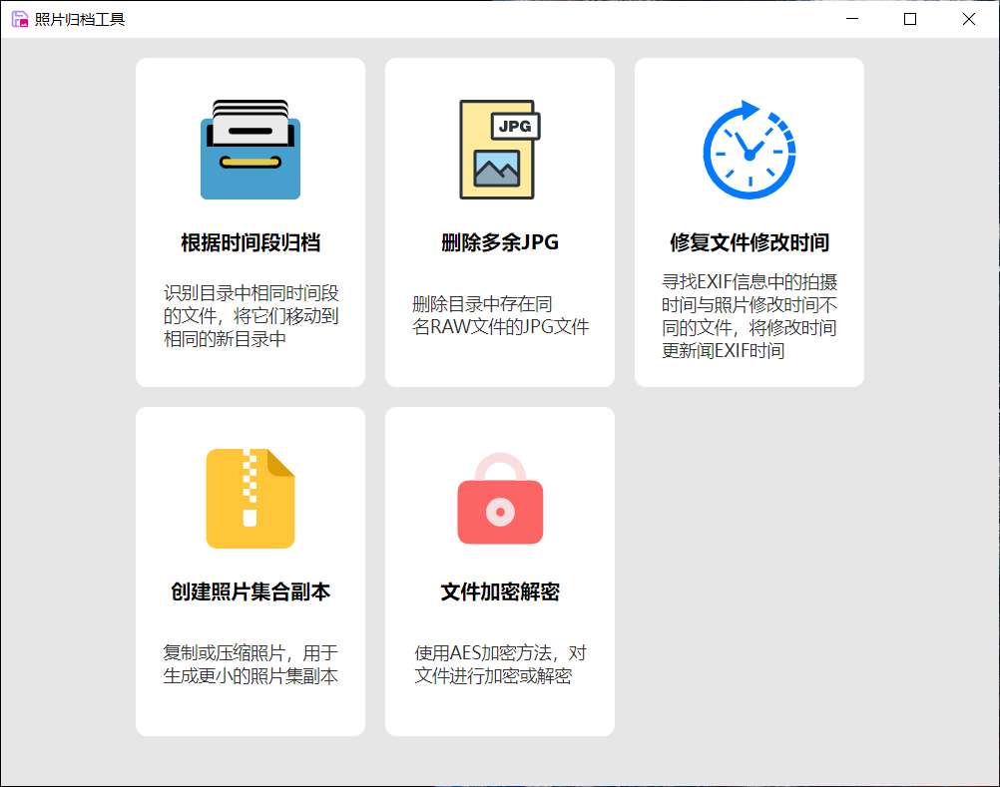
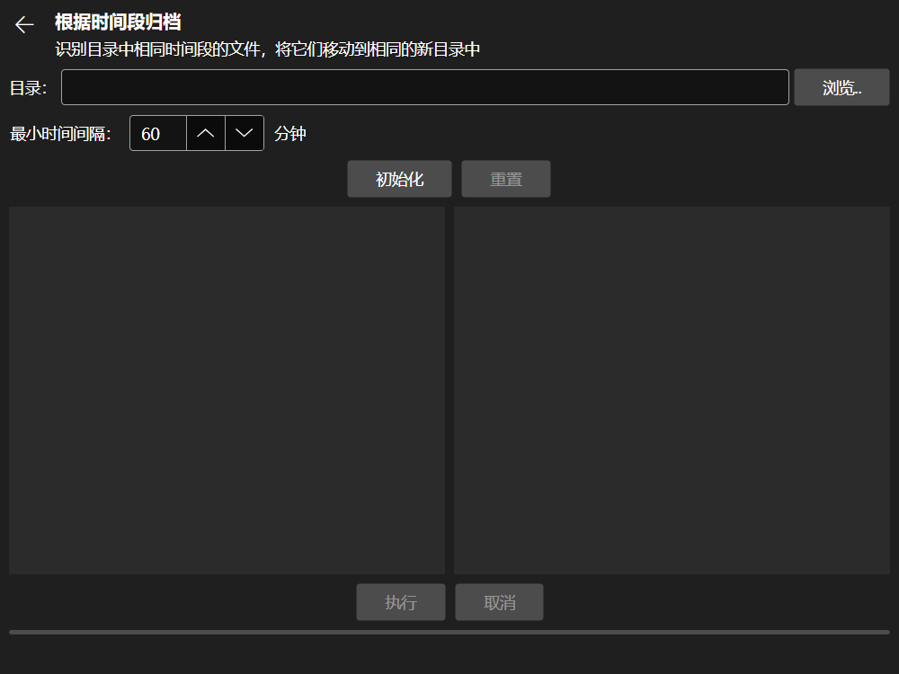
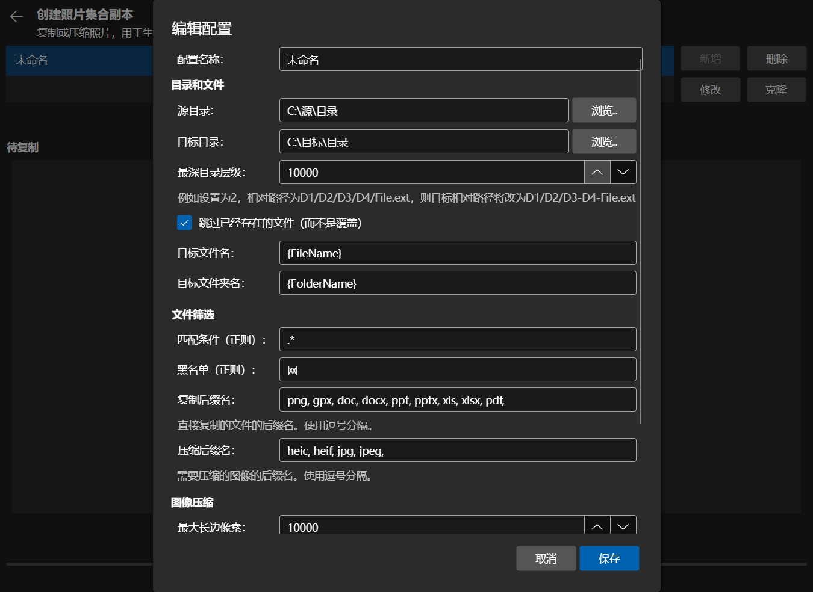

# 文件归档大师

## 简介

这是一套协助用户对文件进行处理、管理、备份、同步的工具集。

在开始这个项目之前的许多年，我已经陆续写了很多的用于备份、同步、管理文件或照片的软件，包括：

- [文件备份工具](https://github.com/autodotua/FileBackuper_New)
- 文件批量操作
- [异地备份离线同步](https://github.com/autodotua/OffsiteBackupOfflineSync)
- [照片瘦身工具](https://github.com/autodotua/PhotoSlimming)
- [照片归档工具](https://github.com/autodotua/PhotoArchivingTools)
- [光盘归档工具](https://github.com/autodotua/DiscArchivingTool)
- 控制台小程序集
- 文件归位器
- 文件夹加密

这些工具功能各异，界面各不相同，技术水平差异很大，操作方式也不尽相同。因此，我希望通过本项目，把这些工具进行整合，使用跨平台的[Avalonia](https://github.com/AvaloniaUI/Avalonia)技术承载GUI。

## 工具

### 照片工具

一套用来解决照片（以及部分文件）在预处理、整理、存档、浏览等环节存在问题的自动化工具

| 工具名           | 用途                                                         | 期望解决的问题                                               | 类名前缀             | 原项目                                                       | 开发进度 |
| ---------------- | ------------------------------------------------------------ | ------------------------------------------------------------ | -------------------- | ------------------------------------------------------------ | -------- |
| 根据时间段归档   | 识别目录中相同时间段的文件，将它们移动到相同的新目录中       | 例如对于航拍照片，多次起飞的照片和视频会混在一起。通过该工具，可以通过拍摄时间来自动将不同航次的照片和视频进行归类。 | `TimeClassify`       | [照片归档工具](https://github.com/autodotua/PhotoArchivingTools) | 已完成   |
| 删除多余JPG      | 删除目录中存在同名RAW文件的JPG文件                           | 当拍摄了RAW+JPG格式的照片时，若决定处理RAW文件，那么JPG格式是多余的，需要删除。 | `UselessJpgCleaner`  | [照片归档工具](https://github.com/autodotua/PhotoArchivingTools) | 已完成   |
| 修复文件修改时间 | 寻找EXIF信息中的拍摄时间与照片修改时间不同的文件，将修改时间更新闻EXIF时间 | 对照片进行处理后，文件修改时间会更新，不利于部分软件的照片排序，需要从EXIF中读取实际拍摄时间，对文件修改时间进行更新。 | `RepairModifiedTime` | [照片归档工具](https://github.com/autodotua/PhotoArchivingTools) 控制台小程序集 | 已完成   |
| 创建照片集合副本 | 复制或压缩照片，用于生成更小的照片集副本                     | 需要将硬盘中整理后的部分照片复制到手机中以便随时查看，但可能存在文件过大放不进手机、只需要部分目录中的文件、只需要部分类型文件等需求。 | `PhotoSlimming`      | [照片归档工具](https://github.com/autodotua/PhotoArchivingTools) [照片瘦身工具](https://github.com/autodotua/PhotoSlimming) | 已完成   |

### 文件（夹）工具

| 工具名       | 用途                                  | 期望解决的问题                                               | 类名前缀    | 原项目                                                       | 开发进度 |
| ------------ | ------------------------------------- | ------------------------------------------------------------ | ----------- | ------------------------------------------------------------ | -------- |
| 文件加密解密 | 使用AES加密方法，对文件进行加密或解密 | 需要对一个文件夹内的文件和子文件进行加密，并需要保留目录结构，需要加密文件名、文件夹名或目录结构。 | `Encryptor` | [照片归档工具](https://github.com/autodotua/PhotoArchivingTools) 文件夹加密 | 已完成   |
| 文件结构克隆 |                                       |                                                              |             | [异地备份离线同步](https://github.com/autodotua/OffsiteBackupOfflineSync) 控制台小程序集 | 未开始   |
| 文件归位     |                                       |                                                              |             | [异地备份离线同步](https://github.com/autodotua/OffsiteBackupOfflineSync) 文件归位器 | 未开始   |

### 异地备份离线同步

| 工具名       | 用途 | 期望解决的问题 | 类名前缀 | 原项目                                                       | 开发进度 |
| ------------ | ---- | -------------- | -------- | ------------------------------------------------------------ | -------- |
| 建立异地快照 |      |                |          | [异地备份离线同步](https://github.com/autodotua/PhotoArchivingTools) | 未开始   |
| 本地制作补丁 |      |                |          | [异地备份离线同步](https://github.com/autodotua/OffsiteBackupOfflineSync) | 未开始   |
| 异地更新     |      |                |          | [异地备份离线同步](https://github.com/autodotua/OffsiteBackupOfflineSync) | 未开始   |

### 光盘归档工具

| 工具名 | 用途 | 期望解决的问题 | 类名前缀 | 原项目                                                       | 开发进度 |
| ------ | ---- | -------------- | -------- | ------------------------------------------------------------ | -------- |
| 打包   |      |                |          | [光盘归档工具](https://github.com/autodotua/DiscArchivingTool) | 未开始   |
| 重建   |      |                |          | [光盘归档工具](https://github.com/autodotua/DiscArchivingTool) | 未开始   |
| 校验   |      |                |          | [光盘归档工具](https://github.com/autodotua/DiscArchivingTool) | 未开始   |
| 更新   |      |                |          | [光盘归档工具](https://github.com/autodotua/DiscArchivingTool) | 未开始   |

### 文件批量操作

| 工具名     | 用途 | 期望解决的问题 | 类名前缀 | 原项目       | 开发进度 |
| ---------- | ---- | -------------- | -------- | ------------ | -------- |
| 普通重命名 |      |                |          | 文件批量操作 | 未开始   |
| 批量重命名 |      |                |          | 文件批量操作 | 未开始   |

## 结构

### 解决方案结构

解决方案主要结构为项目框架-模块的形式，各模块名称均为`ArchiveMaster.Module.*`，独立编译成dll，然后由`ArchiveMaster.UI`进行反射调用。

| 项目名称                   | 类型     | 描述                                                         | 依赖                 |
| -------------------------- | -------- | ------------------------------------------------------------ | -------------------- |
| `ArchiveMaster.Core`       | 依赖编译 | 同时被`.UI`和`.Module.*`调用，包含一些基础的接口、基类、配置约定等 |
| `ArchiveMaster.UI`         | 依赖编译 | 界面管理程序                                                 | `ArchiveMaster.Core` |
| `ArchiveMaster.UI.Desktop` | 启动模块 | 界面的桌面端启动器                                           | `ArchiveMaster.UI`   |
| `ArchiveMaster.Module.*`   | 独立编译 | 每个模块在界面上显示为一个组别，同一类的工具放在同一个模块中 | `ArchiveMaster.Core` |

### 项目内部结构

除了`ArchiveMaster.UI.Desktop`外，其余项目结构基本一致。即，本解决方案分项目并不是从数据-逻辑-界面的角度来分的，更多的是从调用关系链角度。

| 项目名称     | 描述                                                      |
| ------------ | --------------------------------------------------------- |
| `Assets`     | 图标等素材文件，作为`AvaloniaResource`                    |
| `Configs`    | 工具的配置文件                                            |
| `Converters` | 用于XAML的值转换器                                        |
| `Messages`   | 用于ViewModel和View之间通过`WeakReferenceMessenger`的通信 |
| `Utilities`  | 各工具的执行逻辑代码                                      |
| `ViewModels` | 视图模型，连接`Views`、`Configs`和`Utilities`             |
| `Views`      | 视图界面                                                  |

## 截图（正在开发中，以下为[照片归档工具](https://github.com/autodotua/PhotoArchivingTools)的截图）

